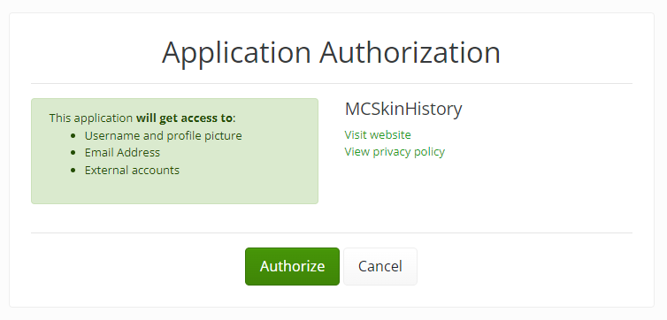

# Registration

This guide will help you sign up for an account on MCSkinHistory.com.

1. MCSkinHistory uses the Gigadrive account system for easier login and account management.

   First, head to the Gigadrive account website to create an account. You can find the registration form [here](https://old.gigadrivegroup.com/register).

   This data is merely used for logging in on MCSkinHistory. Data like your username or email does not have to match your Minecraft account.
2. Once you filled the form, you will receive an email containing a link to verify your email address. Click the link in your email address to verify your account.
3. You can now use your Gigadrive account.
4. Next you will sign up to MCSkinHistory with your Gigadrive account. To start this process, head to **[mcskinhistory.com/login](https://mcskinhistory.com/login)**.
5. Log in with your Gigadrive account data.
6. Next you will find the Application Authorization screen. To log in to MCSkinHistory with you have to share your Gigadrive account data. This screen explains to you what data is being shared.

   
7. Click the **Authorize** button to log in to MCSkinHistory.
8. You will now be redirected back to MCSkinHistory, logged in with your Gigadrive account.

## Linking your Minecraft account

adwiwaip