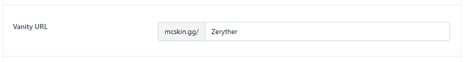
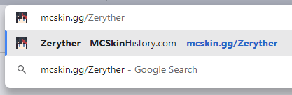

# Vanity URL

> This article is about a feature only available to MCSkinHistory PRO members.

[MCSkinHistory PRO](/help/perks-and-subscriptions/about-mcskinhistory-pro) members get access to a feature called the **Vanity URL**. The Vanity URL is a unique shortlink that can be used across the web to easily link your custom Minecraft profile on MCSkinHistory.com.

The Vanity URL is separately available for all linked Minecraft accounts on a PRO MCSkinHistory account. This means that if you have two Minecraft accounts linked, you can have two Vanity URLs.

## How to change your Vanity URL

1. [Log in with your MCSkinHistory account.](/login)
2. Click your avatar in the top right corner of the website.
3. Click on the "Edit Profile" option.
4. On this page you can choose your Vanity URL:

   
4. Click on "Save changes".
5. You have now claimed your new Vanity URL. Please note that it might take a few minutes for the changes to take into effect.

   
5. The Vanity URL will also be shown on your public profile.

   