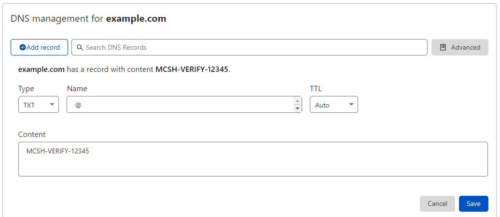

# Claiming a Server Page

As a *Minecraft: Java Edition* server owner, you can claim your server's page on MCSkinHistory and customize it with information, as well as setting up Voting Rewards and bidding on Sponsored Listings.

It is currently not possible to claim servers that use free server hosting services like Minehut or Aternos.

## Claiming your server's page

To claim your server's page, you need to verify that you really own this server. There are currently multiple methods to do this automatically.

If none of these methods suit your needs, send an email to [support@gigadrivegroup.com](mailto:support@gigadrivegroup.com) with other proof of ownership for manual verification.

### TXT DNS Record

You can claim your server's page by adding a TXT DNS Record to your server's domain. This method requires a little technical expertise, as well as access to the DNS records of your root domain name.

This means that if your server address is `play.example.com`, you will need administrative access to the domain name `example.com`. You can add DNS records through your domain registrar. This example will use [CloudFlare](https://cloudflare.com).

1. [Log in with your MCSkinHistory account.](/login)
2. Search for your server's IP address in the search box at the top of the page.
3. On your server's page, scroll to the bottom of the page and click the "**Claim this page**" button.
4. Choose "TXT DNS Record".
5. Copy the DNS Record information found in Step 2.
6. Head to your domain registrar's website and navigate to your domain's DNS settings.
7. Add a DNS Record with the type **DNS** on your root domain (usually value "**@**"). For the value, enter the the token you found on the Claiming page of MCSkinHistory.

   
8. Click **Save**.
9. Head back to MCSkinHistory and click the "**Check DNS records**" button.
10. It may take a while for the changes to take effect. In that case, please wait a few minutes or hours, depending on your domain's name server configuration. Once the check if complete, your server will be registered to your MCSkinHistory account.

### MotD (Server message)

You can claim your server's page by temporarily changing your MotD (message of the day). That's the text that appears in Minecraft's ingame server list. By changing it to a short token, MCSkinHistory can verify that you truly own this server. You can change your MotD back after the verification process is complete.

This method requires a little technical expertise, as well as access to the configuration files of your server.

The process of changing your MotD depends on your server's set up. If you are using a separate plugin to control the contents of your MotD, you will have to refer to that plugin's documentation. This example assumes that you are using a simple Spigot Minecraft server setup and changing your MotD the built-in way.

1. [Log in with your MCSkinHistory account.](/login)
2. Search for your server's IP address in the search box at the top of the page.
3. On your server's page, scroll to the bottom of the page and click the "**Claim this page**" button.
4. Choose "Temporary MotD Change".
5. Copy the line with the token found in Step 2.
6. Head to your server's file directory and open the `server.properties` file.
7. Find the line that starts with `motd=`. Replace the entire line with the line you copied earlier. Please do not insert any color codes, white spaces or other text.
8. Save the file, close it and then restart your server. Your server's in-game list message should now display a token that starts with `MCSH-VERIFY`.
9. Head back to MCSkinHistory and click the "**Check your server status**" button.
10. It may take a while for the changes to take effect. In that case, please wait a few minutes or hours. Once the check if complete, your server will be registered to your MCSkinHistory account.
11. Optionally, you can now change your MotD back.

### Manual Verification

If none of these methods suit your needs, send an email to [support@gigadrivegroup.com](mailto:support@gigadrivegroup.com) with other proof of ownership for manual verification.